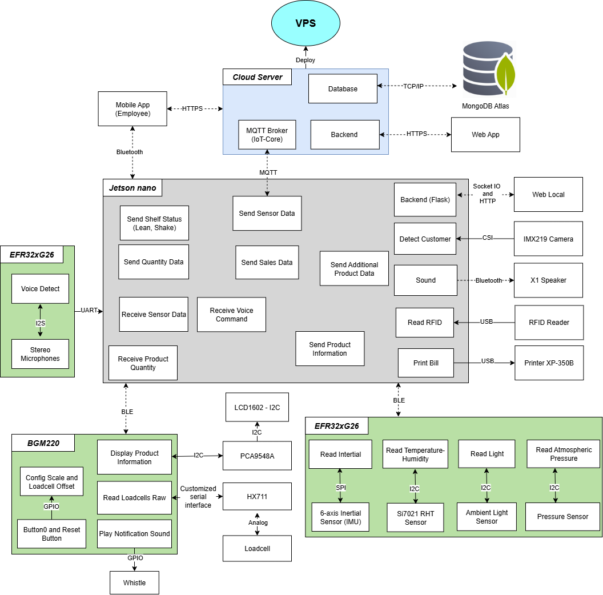

# Smart Vending Shelf

The **Smart Vending Shelf** system enables real-time inventory tracking, detects when a customer picks up a product, supports fast QR-based contactless payment, and automatically alerts if unpaid behavior is detected. The system combines IoT + AI + Mobile App to optimize store operations and enhance user experience.

---

## Demo Video

🎥 [Watch the full demo video here](https://vlylm-my.sharepoint.com/:v:/g/personal/foxiary_vlylm_onmicrosoft_com/IQDMOHBvWFmYQZ5VyPdB_Z2_Ad5Sep8zGlACfSiJdUPBNfI?e=SdHGfG)

---

## How to use the template

* Create your software projects under the `projects/` folder.
* Check the `.gitignore` file and modify it if necessary.
* OPTIONAL: Check the `./Dockerfile` and extend it if necessary.
* Make sure that the whole project can be compiled with a single `make all` command.
* Also implement `make clean`.
* OPTIONAL: Fill out the `CODEOWNERS` file. [GitHub Guide](https://docs.github.com/en/repositories/managing-your-repositorys-settings-and-features/customizing-your-repository/about-code-owners).
* Check the available workflows and adjust them if needed.

Use the following header in your source code:

```c
/***************************************************************************//**
 *Licensed to the Apache Software Foundation (ASF) under one
 *or more contributor license agreements.  See the NOTICE file
 *distributed with this work for additional information
 *regarding copyright ownership.  The ASF licenses this file
 *to you under the Apache License, Version 2.0 (the
 *"License"); you may not use this file except in compliance
 *with the License.  You may obtain a copy of the License at
 *
 *  http://www.apache.org/licenses/LICENSE-2.0
 *
 *Unless required by applicable law or agreed to in writing,
 *software distributed under the License is distributed on an
 *"AS IS" BASIS, WITHOUT WARRANTIES OR CONDITIONS OF ANY
 *KIND, either express or implied.  See the License for the
 *specific language governing permissions and limitations
 *under the License.
 ******************************************************************************/
```

---

## Hardware Requirements

* **Edge Computing:** Jetson Nano (Ubuntu 20.04)
* **IoT MCUs:**

  * BGM220 (reads load cell via HX711, communicates via BLE)
  * EFR32xG26 (reads temperature/pressure/light/IMU sensors, receives UART commands, performs voice processing)
* **Sensors and peripherals:**

  * Load cell + HX711
  * LCD1602 (I2C)
  * RFID Reader (USB)
  * IMX219 Camera (CSI)
  * XP-350B Printer (USB)
  * X1 Bluetooth Speaker
* **Server:** VPS (runs Cloud Backend + MQTT Broker + MongoDB Atlas)

---

## Hardware Setup



* Load cell measures weight → BGM220 processes raw data → sends product quantity via BLE to Jetson.
* EFR32xG26 reads environmental sensor data and receives commands from Jetson via UART.
* Jetson processes camera data (YOLO + SORT), collects sensor data, and syncs to the cloud via MQTT.
* Cloud Server stores data in MongoDB Atlas, provides REST API and web dashboard.
* Mobile App communicates with Cloud Server via HTTPS to display data and receive alerts.

---

## Build Environment Setup

### Windows

1. Install [Visual Studio Code](https://code.visualstudio.com/) or your preferred IDE.
2. Install [Python 3.8+](https://www.python.org/downloads/) and add it to PATH.
3. Install required libraries from `requirements.txt`:

   ```bash
   pip install -r requirements.txt
   ```
4. Install [Node.js LTS](https://nodejs.org/) if you need to build the web dashboard.
5. Configure SSH connection to VPS (if deploying the cloud manually).

### Linux (Jetson Nano)

1. Flash JetPack OS.
2. Update system packages:

   ```bash
   sudo apt update && sudo apt upgrade
   ```
3. Install AI dependencies: OpenCV, PyTorch, TensorRT.
4. Clone the repo and install requirements for `local_server`.
5. Check CSI camera and USB devices are detected properly.

---

## Debug Environment

* **Jetson Nano:** use VS Code Remote SSH for direct debugging.
* **Flask + SocketIO:** run in debug mode (`FLASK_ENV=development`) to monitor logs.
* **BGM220/EFR32:** debug via Simplicity Studio Debugger, view live UART logs.
* **Mobile App:** use Flutter DevTools or React Native Debugger for real-time logs.

---

## License

This project is released under [Apache License 2.0](LICENSE).

---

## Secrets

The following secrets are required for the project:

* `MONGODB_URI`: Connection string to MongoDB Atlas.
* `MQTT_BROKER_URL`: IoT-core broker address.
* `API_KEY` or `JWT_SECRET` (if using authentication).
* `PAYMENT_GATEWAY_KEY`: Key for VietQR/SEPAY integration.